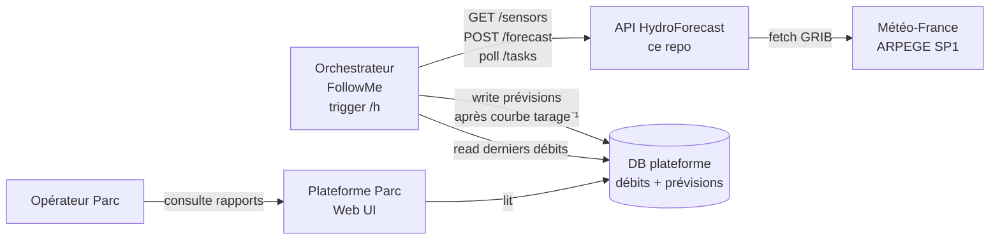
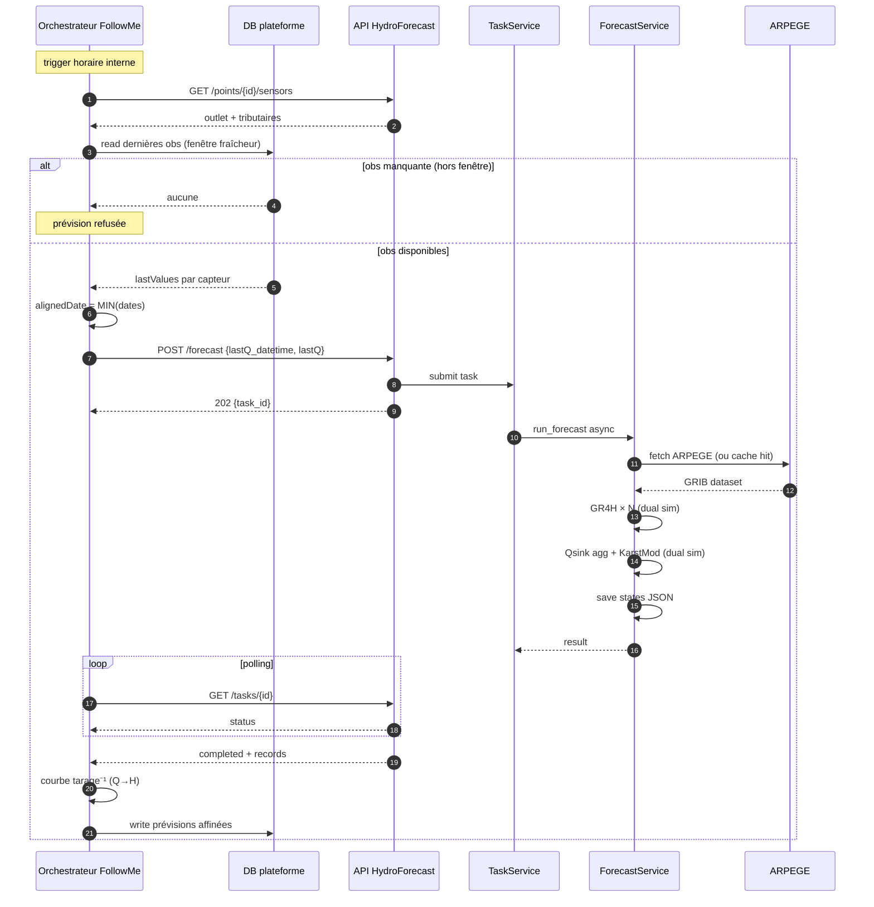
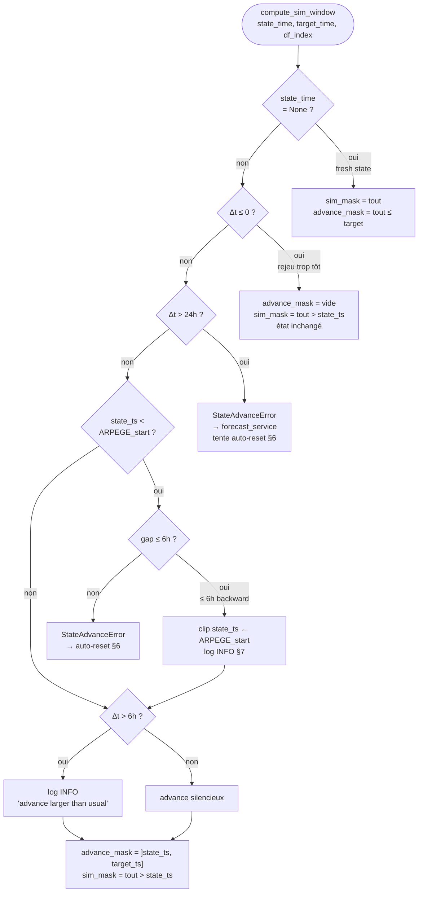
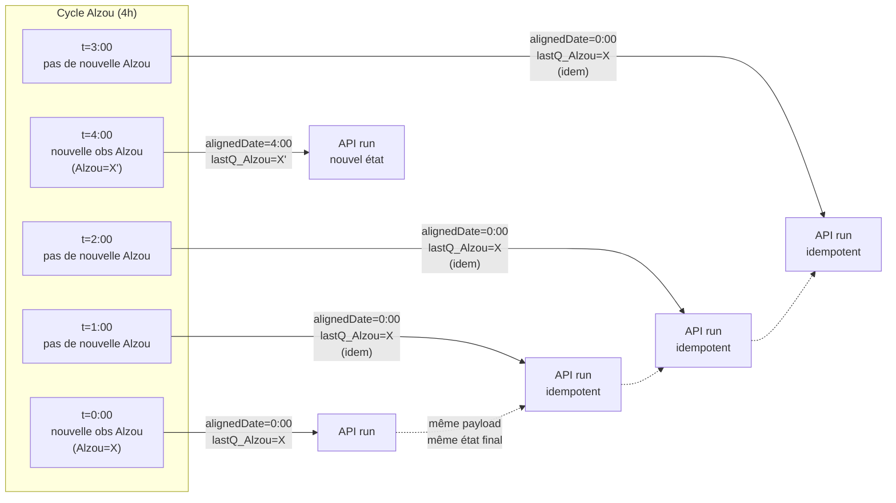
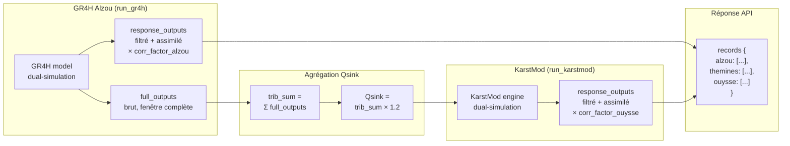
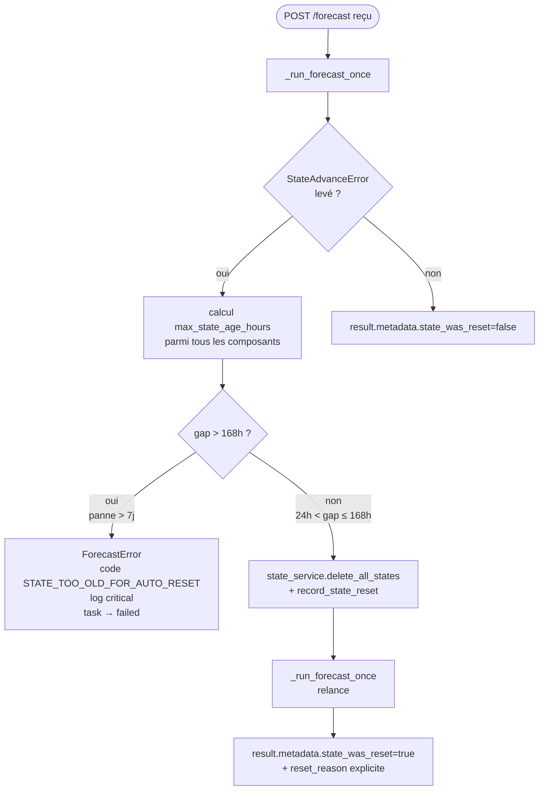
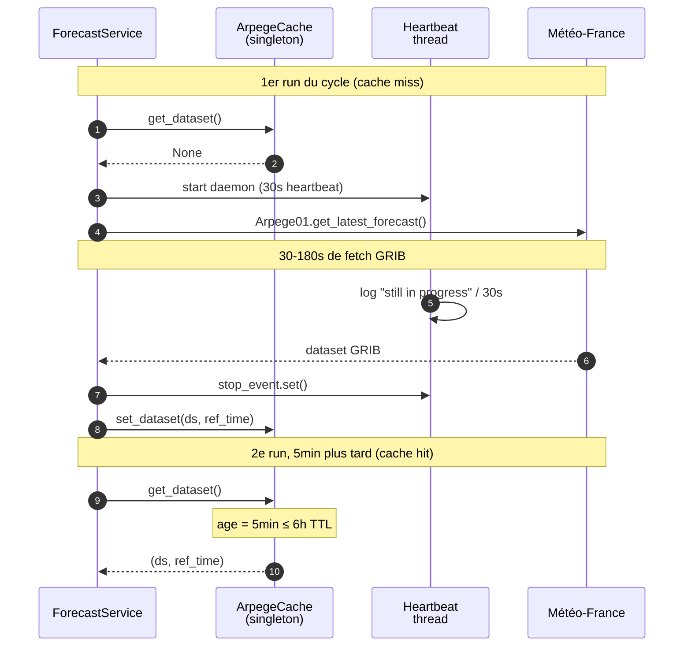
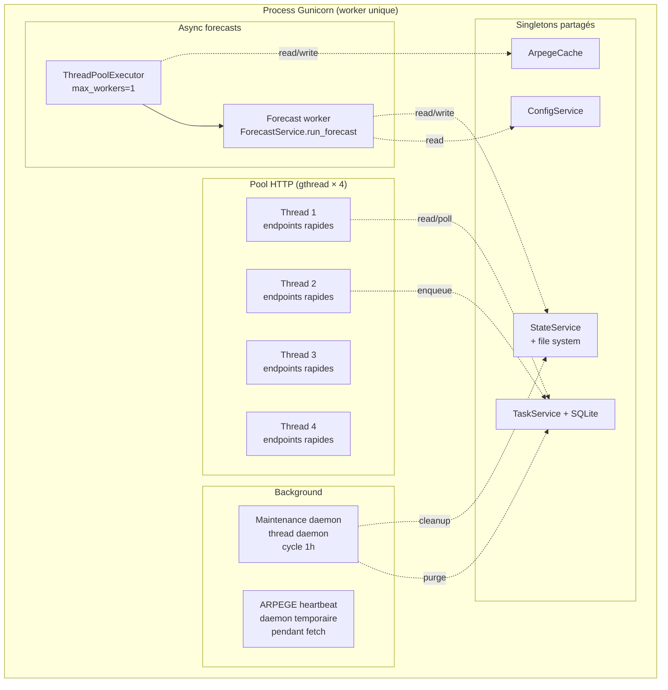

# Architecture & flux opérationnel — HydroForecast API

> **Dernière revue** : 2026-05-11. Toute modification sur `state_advance.py`, `forecast_service.py`, `gr4h_runner.py`, `arpege_cache.py` ou `gunicorn.conf.py` doit déclencher une relecture de ce document.

## À qui sert ce document

Ce doc complète les README/CONTRIBUTING/API_RESPONSES en répondant aux questions **« comment ça s'orchestre et pourquoi »** plutôt que « quoi » et « comment l'utiliser ». Il documente les mécanismes critiques qui ne sont pas évidents à la lecture du code seul : horodatage des états, cadence asymétrique des observations, choix d'assimilation, auto-reset, cache ARPEGE, contraintes de concurrence.

Lecteur cible : développeur Synapse ou intégrateur partenaire qui doit comprendre le système avant de modifier la logique métier ou la configuration de production.

Pour l'utilisation (endpoints, payloads), voir [README.md](../README.md). Pour les conventions de code et procédures opérationnelles, voir [CONTRIBUTING.md](../CONTRIBUTING.md). Pour le format des réponses, voir [API_RESPONSES.md](API_RESPONSES.md).

---

## Sommaire

1. [Vue d'ensemble (context map)](#1-vue-densemble-context-map)
2. [Cycle de vie d'une prévision](#2-cycle-de-vie-dune-prévision)
3. [Logique d'horodatage : `state_time` + Δt dynamique](#3-logique-dhorodatage--state_time--δt-dynamique)
4. [Cadence asymétrique : Alzou 4h vs runs 1h](#4-cadence-asymétrique--alzou-4h-vs-runs-1h)
5. [Assimilation : où, sur quoi, pourquoi pas partout](#5-assimilation--où-sur-quoi-pourquoi-pas-partout)
6. [Robustesse : auto-reset après dérive d'état](#6-robustesse--auto-reset-après-dérive-détat)
7. [Tolérance backward : ARPEGE plus récent que l'état](#7-tolérance-backward--arpege-plus-récent-que-létat)
8. [Cache ARPEGE](#8-cache-arpege)
9. [Concurrence et workers](#9-concurrence-et-workers)
10. [Modèles de données](#10-modèles-de-données)
11. [`custom_meteo` : injection météo manuelle](#11-custom_meteo--injection-météo-manuelle)
12. [Frontière prod ↔ élaboration](#12-frontière-prod--élaboration)
13. [Glossaire & cartographie](#13-glossaire--cartographie)

---

## 1. Vue d'ensemble (context map)

**Pourquoi cette section existe** : situer l'API dans son écosystème. La lecture du code seul ne dit pas qui appelle, qui est appelé, ni où vont les résultats.

### Acteurs

- **Opérateur Parc** (utilisateur final) — consulte les prévisions et l'état de la ressource via la plateforme Parc.
- **Plateforme Parc** — UI web qui agrège mesures et prévisions ; côté DB c'est elle qui matérialise les rapports et les pastilles de seuils.
- **FollowMe** — orchestrateur Synapse de modèles de prévision (jeu de mot : *Follow* notre solution + *Model Engine*). Déclenche les prévisions à cadence horaire, assemble le payload avec les dernières observations, appelle l'API, polle le résultat, l'inverse via la courbe de tarage et l'écrit en DB.
- **API HydroForecast** (ce repo) — service stateless côté HTTP, stateful côté fichier (états des réservoirs). Reçoit les requêtes, fetch la météo, exécute la chaîne GR4H → KarstMod, persiste les états, renvoie la prévision.
- **Météo-France ARPEGE** — source des forçages météo (paquet SP1, variables `t2m` + `tp`), publié ~4×/jour (00h, 06h, 12h, 18h UTC). Téléchargement via `meteofetch.Arpege01`.

### Notion de « point »

Un **point** (identifiant : `ouysse`) regroupe une configuration YAML, un ensemble de capteurs (un outlet + N tributaires), et un ensemble d'états persistés (un fichier JSON par composant). C'est l'unité d'extension : pour modéliser un autre bassin karstique, on ajoute un YAML dans `configs/points/`, sans toucher au code.

### Diagramme — context map



---

## 2. Cycle de vie d'une prévision

**Pourquoi cette section existe** : décrire le flux end-to-end nominal, du déclenchement par l'orchestrateur jusqu'au stockage en DB. Toutes les autres sections sont des branches ou des invariants de ce flux.

### Déroulé

1. **Déclenchement** — l'orchestrateur FollowMe déclenche une demande de prévision à cadence horaire.
2. **Découverte capteurs** — FollowMe appelle `GET /api/v1/points/{id}/sensors` (l'API renvoie la liste outlet + tributaires).
3. **Récupération obs** — FollowMe va chercher en base les dernières valeurs de débit pour chaque capteur dans une fenêtre de fraîcheur configurable. Si un capteur n'a pas d'obs dans la fenêtre, la prévision est refusée d'office et on ne passe pas à l'étape suivante.
4. **Alignement temporel** — FollowMe calcule `alignedDate = MIN(dernières dates obs)` et prend pour chaque capteur la valeur la plus proche `≤ alignedDate`. Détail dans §4.
5. **POST forecast** — `POST /api/v1/points/{id}/forecast` avec `{lastQ_datetime: alignedDate, tributaries: {…}, karstmod: {…}}`. Réponse 202 + `task_id`.
6. **Exécution asynchrone** côté API — `task_service` enqueue dans le ThreadPoolExecutor mono-worker. La fonction `forecast_service.run_forecast` orchestre :
   - charge la config YAML du point ;
   - fetch ARPEGE (hit cache ou network, §8) ;
   - nettoie les vieux backups ([forecast_service.py:165-168](../app/services/forecast_service.py#L165-L168)) ;
   - run GR4H par tributaire avec pattern dual-simulation (§3) ;
   - agrège la Qsink (§5) ;
   - run KarstMod sur la même fenêtre, idem dual-simulation ;
   - sauve les nouveaux états ;
   - construit la réponse compacte (`records` par capteur).
7. **Polling** — FollowMe polle `GET /api/v1/tasks/{task_id}` jusqu'à `completed` ou `failed`.
8. **Inversion courbe de tarage** — FollowMe transforme les débits (m³/s) en hauteurs (m) via la courbe de tarage inverse, segment par segment (interpolation linéaire ou polynomiale par bisection selon le type de loi).
9. **Persistance** — FollowMe enregistre l'exécution puis les valeurs prévues offset par offset dans la table des prévisions affinées de la plateforme.

### Diagramme — séquence end-to-end



### Codes d'erreur possibles

| Étape | Erreur typique | Source | Effet |
|---|---|---|---|
| 3 | Obs Alzou périmée | FollowMe | Prévision refusée, API non appelée. |
| 5 | Validation payload | API (Marshmallow) | 400 immédiat. |
| 6 | Fetch ARPEGE échoue 3× | API (`arpege_fetcher`) | Fallback stale cache, sinon task `failed`. |
| 6 | Δt > 24h | API (`state_advance`) | Bascule auto-reset (§6). |
| 6 | Δt > 168h | API (`forecast_service`) | `STATE_TOO_OLD_FOR_AUTO_RESET`. |
| 8 | Débit hors bornes courbe | FollowMe | Pas de temps ignoré (warning log). |

---

## 3. Logique d'horodatage : `state_time` + Δt dynamique

**Pourquoi cette section existe** : c'est LE mécanisme qui rend le système robuste aux cadences variables et aux runs ratés. Sans cette section, on croit que le système dépend du nombre de runs successifs alors qu'il dépend uniquement du Δt entre deux états.

### Format des fichiers d'état

Chaque composant (GR4H par tributaire, KarstMod) persiste son état dans `states/{point_id}/{component}.json`. Exemple :

```json
{
  "production_store": 0.4231,
  "routing_store": 0.5102,
  "state_time": "2026-05-11T14:00:00"
}
```

Le champ `state_time` (ISO datetime) **est l'instant que représente cet état**. Il est ajouté à chaque sauvegarde par les runners :
- GR4H : [gr4h_runner.py:103-104](../app/models/gr4h_runner.py#L103-L104).
- KarstMod : [karstmod_runner.py:115](../app/models/karstmod_runner.py#L115) et [:122](../app/models/karstmod_runner.py#L122).

Quand `forecast_service` charge un état, il extrait `state_time` et le sépare du dict de paramètres : [forecast_service.py:192](../app/services/forecast_service.py#L192) et [:242](../app/services/forecast_service.py#L242). Indispensable, sinon `hydrogr.ModelGr4h.set_states()` lève une erreur sur la clé inconnue.

### `compute_sim_window` : le cœur du dispositif

Fonction unique dans [state_advance.py:35](../app/models/state_advance.py#L35). Calcule à partir de l'index ARPEGE, de `state_time` et de `target_time` (typiquement `lastQ_datetime`) trois choses :

- `advance_hours = (target_ts - state_ts).total_seconds() / 3600` — le Δt en heures.
- `advance_mask` — booléens sur l'index ARPEGE, sélectionnant les lignes `]state_ts, target_ts]`. Ces lignes nourrissent la **passe courte** qui produit le nouvel état persisté.
- `sim_mask` — booléens sélectionnant toutes les lignes `> state_ts`. Ces lignes nourrissent la **passe longue** qui produit la prévision retournée au client.

### Pattern dual-simulation

Les deux runners (`run_gr4h`, `run_karstmod`) suivent le même schéma :

1. Instancier deux modèles avec **le même état initial** chargé depuis JSON.
2. Faire tourner le 1er sur `advance_mask` → état final = nouvel `state_time`, **persisté**.
3. Faire tourner le 2e sur `sim_mask` → série complète, filtrée à `lastQ_datetime`, assimilée, **retournée** au client.

C'est ce qui permet de servir une prévision de 96h tout en n'avançant l'état persisté que de Δt (= 1h en routine, ou 4h en rattrapage Alzou, ou plus si run raté).

### Diagramme — branches de décision selon Δt



### Idempotence

Deux runs successifs avec **le même `lastQ_datetime`** (et le même ARPEGE) produisent la même prévision et le même état final. Propriété critique pour le cycle Alzou de §4.

### Pièges connus

- **Ne pas écrire `state_time` directement dans le dict passé à `set_states()`** : `hydrogr` lève sur clé inconnue. Toujours `pop("state_time")` avant.
- **`lastQ_datetime` est le `target_time`** côté API, ce n'est PAS l'âge de l'observation. Voir §4 pour la sémantique côté orchestrateur.

---

## 4. Cadence asymétrique : Alzou 4h vs runs 1h

**Pourquoi cette section existe** : à l'observation prod, sur un cycle de 4h Alzou, on a 3 prévisions avec le même payload + 1 échec. On pourrait croire à un bug ou à une surcorrection répétée. Cette section explique pourquoi c'est sain — l'alignement orchestrateur garantit la cohérence physique.

### Contraintes physiques

| Source | Cadence d'arrivée | Côté API |
|---|---|---|
| ARPEGE Météo-France | Publication ~4×/jour, cache 6h | Lit le dernier disponible |
| Capteur outlet (Ouysse) | ~1h | `lastQ_karstmod` |
| Capteur Themines | ~1h | `lastQ_themines` |
| Capteur Alzou | **~4h** (chaîne de remontée lente) | `lastQ_alzou` |
| Trigger orchestrateur | 1h | Déclenche la chaîne |

### Mécanisme d'alignement côté orchestrateur

Trois règles clés implémentées par FollowMe :

- **Fenêtre de fraîcheur** — un paramètre configurable `AssimilationMaxDelayMinutes` borne l'âge accepté pour une observation. Un capteur dont la dernière obs est plus vieille que cette fenêtre est considéré indisponible.
- **Refus d'office** — si un capteur (typiquement Alzou) n'a aucune obs dans la fenêtre, la prévision est refusée d'office. L'API n'est même pas appelée.
- **Alignement temporel** — `alignedDate = MIN(dernières dates obs par capteur)`. On prend l'instant **le plus ancien** parmi les dernières dates de chaque capteur. Pour chaque capteur, on prend ensuite la valeur la plus proche `≤ alignedDate`.

Le `lastQ_datetime` envoyé à l'API est donc **toujours l'instant exact où toutes les `lastQ` étaient physiquement valides simultanément** — typiquement l'instant de la dernière obs Alzou.

### Conséquence sur un cycle de 4h



Les 4 runs intermédiaires sont **idempotents** côté API. Le seul élément qui peut changer entre eux, c'est ARPEGE (si Météo-France publie un nouveau run pendant le cycle Alzou) — auquel cas la prévision aval se met à jour automatiquement, ce qui est souhaitable.

### Coût de l'alignement

Themines et Karstmod ont des obs fraîches toutes les heures. Dans un cycle Alzou de 4h, on **jette 3 obs sur 4** pour ces capteurs (verrouillées par `alignedDate = date_Alzou`). Acceptable : la cohérence physique (toutes les `lastQ` au même instant) prime sur la fraîcheur individuelle.

### Pré-requis production

`AssimilationMaxDelayMinutes` doit être **≥ 240 minutes** pour tolérer la cadence Alzou. Si laissée à 60 (default code), 3 runs sur 4 sont refusés côté orchestrateur et on n'utilise qu'1 run par cycle Alzou.

### Pièges connus

- **Si `AssimilationMaxDelayMinutes` < 240** : symptôme = 3 ECH_PREV + 1 succès par cycle de 4h, au lieu de 4 succès (ou 3 succès + 1 échec pendant la transition). À vérifier en config prod.
- **L'API ne valide pas l'âge de `lastQ`** : tout le contrat sur la fraîcheur est délégué à l'orchestrateur. Un autre client qui ignorerait l'alignement pourrait envoyer une `lastQ_Alzou` périmée avec un `lastQ_datetime` plus récent → la sortie Alzou affichée serait biaisée (mais KarstMod resterait protégé, voir §5).

---

## 5. Assimilation : où, sur quoi, pourquoi pas partout

**Pourquoi cette section existe** : sujet contre-intuitif. KarstMod consomme la GR4H Alzou **non-assimilée** alors qu'on dispose des valeurs assimilées. Sans cette section, un dev pourrait « corriger » et casser la physique aval.

### Formule

[`assimilate_flow`](../app/models/gr4h_runner.py#L31-L35) (et son jumeau identique [karstmod_runner.py:29-33](../app/models/karstmod_runner.py#L29-L33)) :

```python
if last_q and len(outputs) > 0 and outputs[flow_col].iloc[0] != 0:
    correction_factor = last_q / outputs[flow_col].iloc[0]
    outputs[flow_col] = outputs[flow_col] * correction_factor
```

- **Multiplicative** sur toute la fenêtre de sortie filtrée à `lastQ_datetime`.
- **Cible** = la 1ère valeur de cette fenêtre, qui correspond à l'instant `lastQ_datetime`.
- Garde contre la division par zéro : pas d'assimilation si le modèle prédit 0.

### Deux séries, deux destinations

Pour chaque tributaire, `run_gr4h` produit deux DataFrames :

- `response_outputs` — filtré à `lastQ_datetime`, **assimilé**. Renvoyé au client via `tributary_results` puis sérialisé dans `records["alzou"]`, etc.
- `full_outputs` — fenêtre complète depuis `state_time`, **brut** (jamais assimilé). Utilisé en interne pour calculer la Qsink alimentant KarstMod.

C'est la séparation explicite [gr4h_runner.py:113-123](../app/models/gr4h_runner.py#L113-L123).

### Routage de la Qsink

[`forecast_service.py:211-225`](../app/services/forecast_service.py#L211-L225) — commentaire dans le code :

> `# Combine tributary flows into Qsink (use unfiltered, non-assimilated series).`

```python
trib_sum = np.zeros(len(sim_window_idx), dtype=np.float64)
for r in tributary_full_outputs.values():
    trib_sum += r["flow_m3_s"].values
qsink_window = trib_sum * qsink_multiplier
```

**Important** : la boucle itère sur `tributary_full_outputs`, **pas** sur `tributary_results`. La Qsink envoyée à KarstMod est donc la sortie GR4H brute multipliée par `qsink_multiplier` (1.2 pour Ouysse, configurable dans le YAML).

### Pourquoi cette dissymétrie

- L'assimilation Alzou est valable **à l'instant `lastQ_datetime`** uniquement. Au-delà, c'est le modèle GR4H qui propage. La correction multiplicative force la cohérence avec l'observation au point de départ, mais elle est artificielle sur les heures suivantes.
- Si on injectait la série assimilée dans KarstMod, on convolutionnerait deux corrections : celle d'Alzou (sur 96h via le facteur) + celle d'Ouysse (lastQ_karstmod). Double biais sans justification physique.
- KarstMod a sa **propre assimilation** sur la `lastQ_karstmod` (capteur exutoire), appliquée sur sa propre sortie filtrée [karstmod_runner.py:143-145](../app/models/karstmod_runner.py#L143-L145). Cette correction-là est saine : elle cale le débit Ouysse à `lastQ_datetime` sur l'observation outlet réelle.

### Diagramme — deux chemins distincts



### Pièges connus

- **Ne JAMAIS remplacer `tributary_full_outputs` par `tributary_results` dans la boucle Qsink** : KarstMod recevrait une Qsink doublement biaisée.
- **Si une `lastQ` tributaire est `None`** : la garde dans `assimilate_flow` no-op proprement. `response_outputs` reste alors égal à la sortie GR4H brute filtrée — identique à `full_outputs` côté valeurs (mais pas côté fenêtre).
- **La correction multiplicative peut diverger sur 96h** si `last_q / outputs[0]` est très différent de 1. C'est le prix à payer pour la cohérence au point d'observation. Pour le moment pas de garde-fou (à investiguer si on observe des dérives).

---

## 6. Robustesse : auto-reset après dérive d'état

**Pourquoi cette section existe** : si une panne client laisse l'état trop ancien, l'API doit décider seule entre rattrapage silencieux, reset propre, ou refus explicite. Sans cette section, on comprend mal pourquoi certaines prévisions sortent avec `state_was_reset=true` et d'autres échouent avec `STATE_TOO_OLD_FOR_AUTO_RESET`.

### Seuils

Dans [state_advance.py:17-22](../app/models/state_advance.py#L17-L22) :

| Constante | Valeur | Sens |
|---|---|---|
| `ADVANCE_WARN_HOURS` | 6 | Log INFO seul, pas d'autre conséquence. |
| `ADVANCE_MAX_HOURS` | 24 | Seuil de bascule en auto-reset. |
| `AUTO_RESET_MAX_HOURS` | 168 (7 jours) | Plafond du reset auto ; au-delà, refus explicite. |

### Workflow `forecast_service.run_forecast`

[forecast_service.py:59-125](../app/services/forecast_service.py#L59-L125) — fonction wrapper qui :

1. Appelle `_run_forecast_once`. Si tout passe, `state_was_reset=False` dans la réponse.
2. Si `StateAdvanceError` est levé (Δt > 24h dans un des composants), calcule `_max_state_age_hours` (le pire des Δt parmi tous les composants persistés).
3. Si `max_gap > AUTO_RESET_MAX_HOURS` (168h) : log `critical` avec `alarm=STATE_TOO_OLD_FOR_AUTO_RESET`, lève `ForecastError(code="STATE_TOO_OLD_FOR_AUTO_RESET")`. **Le client recevra une task en `failed` avec ce code.** Le humain doit intervenir.
4. Sinon (24h < max_gap ≤ 168h) : log `error` avec `alarm=STATE_AUTO_RESET`, appelle `state_service.delete_all_states(point_id)`, incrémente la métrique Prometheus `state_resets_total{reason="age"}`, relance `_run_forecast_once`. La réponse contient `metadata.state_was_reset=true` et un `reset_reason` explicite ("State was Xh behind target…").

### Backups

`state_service.delete_all_states` (à confirmer dans le code) déplace les fichiers vers `backups/` avant suppression. Politique de rétention : `BACKUP_RETENTION_DAYS` (env var, défaut 7), purge automatique par le maintenance daemon (§9).

### Métriques

- Compteur Prometheus `state_resets_total{point_id, reason}` exposé sur `/metrics`.
- Logs : grep `STATE_AUTO_RESET` (auto-reset effectué) ou `STATE_TOO_OLD_FOR_AUTO_RESET` (refus, alerte critique).

### Procédure de reprise manuelle

Détaillée dans [CONTRIBUTING.md § Reprise après dérive d'état](../CONTRIBUTING.md#reprise-après-dérive-détat-auto-recovery). Idée : vérifier que la panne amont est réellement résolue, restaurer un état cohérent depuis un backup ou re-coldstart explicitement.

### Diagramme — branches de décision



### Pièges connus

- **`state_was_reset=true` n'est pas une erreur côté client**, c'est une info. La prévision est servie normalement.
- **Les prévisions à T+24..T+96h après un reset sont dégradées 24-48h** le temps que les réservoirs reconvergent (KarstMod a une mémoire longue). À mentionner aux opérateurs Parc quand on les voit dans les logs.
- **Le reset est all-or-nothing par point** : on ne reset pas seulement le composant qui a dérivé, on reset tout le point (cohérence inter-composants).

---

## 7. Tolérance backward : ARPEGE plus récent que l'état

**Pourquoi cette section existe** : cas inverse de §6 (le state pré-date l'ARPEGE disponible). Arrive en routine quand ARPEGE roule plus vite que les obs lentes Alzou. Pas une erreur, à absorber silencieusement, sinon on aurait des échecs intermittents à chaque rotation ARPEGE.

### Mécanisme

[state_advance.py:81-108](../app/models/state_advance.py#L81-L108) — si `state_ts < ARPEGE_start`, on calcule `backward_gap_hours = ARPEGE_start − state_ts`.

- **Si `backward_gap_hours ≤ BACKWARD_TOLERANCE_HOURS=6`** : log INFO `"State precedes ARPEGE; clipping advance to data start"`, on clippe `state_ts` au début d'ARPEGE (`state_ts = data_start - 1s`), on continue. La météo « perdue » (≤ 6h) est négligeable hydrologiquement ; la prochaine assimilation `lastQ` recale l'outlet de toute façon.
- **Sinon** (> 6h backward) : `StateAdvanceError` → `forecast_service` tente l'auto-reset (§6).

### Cas typique

- ARPEGE roule à 12h UTC (publication 12:00).
- Dernière obs Alzou date de 11:30 UTC → `state_time = 11:30`.
- Nouveau run lancé à 13:00 avec `lastQ_datetime = 11:30` (alignedDate inchangé).
- ARPEGE_start = 12:00. `state_ts = 11:30 < 12:00` → backward de 30 min, bien sous les 6h tolérance → clip silencieux.

Sans ce mécanisme, chaque rotation ARPEGE provoquerait un échec sur le run suivant jusqu'à ce que la prochaine obs Alzou arrive (jusqu'à 4h plus tard).

### Décision diagramme

Branches déjà couvertes dans le diagramme de §3 (boîte `BackwardCheck` / `BackwardGap` / `ClipSilent` / `RaiseBackward`). Pas de diagramme dédié.

---

## 8. Cache ARPEGE

**Pourquoi cette section existe** : un fetch ARPEGE coûte 30-180s de GRIB. Sans cache, chaque run paye ce coût et sature Météo-France.

### Configuration

[arpege_cache.py:16](../app/models/arpege_cache.py#L16) — `DEFAULT_TTL_HOURS = 6`, aligné sur la cadence de publication ARPEGE (00h, 06h, 12h, 18h UTC).

### Implémentation

- Singleton module-level : [arpege_cache.py:76](../app/models/arpege_cache.py#L76) `_cache = ArpegeCache()`.
- Thread-safe via `threading.Lock()`.
- Stocke un `xr.Dataset` + `ref_time` (ISO datetime du run ARPEGE).
- Trois opérations :
  - `get_dataset()` — retourne `(ds, ref_time)` si âge ≤ TTL, sinon `None`. Log INFO `"ARPEGE cache hit"` ou `"ARPEGE cache expired"`.
  - `get_stale_dataset()` — retourne le dataset **même expiré**. Utilisé en fallback quand tous les retries échouent (§ ci-dessous).
  - `set_dataset(ds, ref_time)` — remplace le dataset, reset `_fetched_at`.

### Workflow `fetch_arpege_for_grids`

[arpege_fetcher.py:90-181](../app/models/arpege_fetcher.py#L90-L181) :

1. `cache.get_dataset()` — si hit, on saute directement à l'agrégation spatiale.
2. Sinon, fetch network avec retry : 3 tentatives, backoff `[5, 15]` secondes. Pendant le fetch (long, synchrone), un thread daemon `arpege-heartbeat` log toutes les 30s `"ARPEGE fetch still in progress | elapsed_seconds=..."` pour rassurer l'opérateur ([arpege_fetcher.py:33,44-58](../app/models/arpege_fetcher.py#L33)).
3. Si les 3 tentatives échouent, on tente `cache.get_stale_dataset()`. Si on a un cache même périmé, on l'utilise + log WARNING `"Using stale ARPEGE cache after fetch failure"`. Sinon, l'exception remonte.
4. Sur succès, on cache le dataset frais, on construit l'agrégation spatiale par grille (dot product avec les `weights`, conversion K→°C, PE-Oudin).

### Diagramme — séquence cache miss + hit



### Conséquence sur la cadence

Avec un trigger horaire côté orchestrateur et un TTL 6h : 1 fetch maximum toutes les 6h, soit 4 fetchs par jour. En pratique, on s'aligne sur la publication ARPEGE (4×/jour aussi).

### Lien avec la concurrence

Le cache est **in-memory et local au process**. C'est ce qui motive la config Gunicorn « 1 worker » (§9) : avec N workers, on aurait N caches indépendants, donc N fetchs concurrents quand le TTL expire, et on contournerait totalement le mécanisme.

### Pièges connus

- **Pas de lock englobant le fetch** : si deux threads HTTP/forecast appellent `get_dataset()` simultanément quand le cache est expiré, ils peuvent tous deux décider de fetch en parallèle. En pratique le ThreadPoolExecutor mono-worker (§9) sérialise les forecasts, donc le cas est rare ; à durcir si on a un jour 2 forecasts concurrents.
- **Invalidation manuelle** : `cache.invalidate()` existe mais n'est appelé que par les tests. Pas d'endpoint pour forcer un refresh en prod (à ajouter si besoin).

---

## 9. Concurrence et workers

**Pourquoi cette section existe** : la config Gunicorn (1 worker / 4 threads gthread) est non triviale et critique. Un dev pourrait croire que passer à 4 workers améliore la concurrence — en réalité ça casse le cache ARPEGE, le task_service singleton, et la cohérence des états.

### Config Gunicorn

[gunicorn.conf.py:17-29](../gunicorn.conf.py#L17-L29) :

```python
bind = "0.0.0.0:5000"
workers = 1
threads = 4
worker_class = "gthread"
preload_app = True
timeout = 300
```

Le commentaire dans le code (lignes 18-23) est explicite : **single worker on purpose**. Justifications :

- Le cache ARPEGE (§8) est in-memory : 1 worker = 1 cache partagé. N workers = N caches indépendants.
- Le `task_service` est un singleton module-level avec son propre `ThreadPoolExecutor`. N workers = N executors qui ne se voient pas, file de tâches incohérente.
- Les fichiers d'états (`states/*.json`) sont écrits par les forecasts : sans lock externe, deux workers concurrents sur le même point pourraient corrompre les états.

### Pourquoi 4 threads alors

Les 4 threads HTTP (gthread) servent les endpoints rapides (health, readiness, metrics, polling `/api/v1/tasks/{id}`) **pendant qu'un forecast long tourne dans le thread executor**. `cfgrib` et les sockets relâchent le GIL pendant le fetch ARPEGE, donc les 4 threads HTTP restent réactifs malgré le fetch synchrone.

### ThreadPoolExecutor mono-worker

[task_service.py:29](../app/services/task_service.py#L29) — `ThreadPoolExecutor(max_workers=1)`. Sérialise les forecasts : un seul à la fois, dans un thread séparé du pool HTTP. Quand une 2e requête `/forecast` arrive pendant qu'un forecast tourne, elle est mise en file (`pending` puis `running` dans la SQLite tasks). Le log `queue_depth` ([task_service.py:53-55](../app/services/task_service.py#L53-L55)) trace la profondeur de file.

### Maintenance daemon

[maintenance.py](../app/maintenance.py) — thread daemon séparé, démarré via `init_app`. Cycle :

- Délai initial 60s (laisse l'app finir de démarrer).
- Toutes les 3600s (1h) : purge des tâches > `TASK_RETENTION_DAYS` (env, défaut 7), nettoyage des backups > `BACKUP_RETENTION_DAYS`.
- Chaque tâche est wrappée try/except : une exception ne tue pas le scheduler.

### Filtre de logs

[gunicorn.conf.py:5-14,32-35](../gunicorn.conf.py#L5-L14) — `NoiseFilter` retire des access logs les requêtes vers `/health`, `/readiness`, `/metrics`, `/api/v1/tasks/`. Sans ça, les probes Docker/Prometheus/k8s noient les logs d'application.

### Diagramme — threads dans le process



### Pièges connus

- **Ne JAMAIS passer à `workers > 1`** sans réarchitecturer : cache → externalisation (Redis), task_service → broker (Celery/RQ), states → lock distribué (filelock distribué ou base de données). C'est une décision majeure, pas un tuning.
- **`preload_app = True`** : si un import à l'init lève, le worker ne démarre pas du tout. Tester avec un container fresh régulièrement.
- **`timeout = 300`** (5 min) : un forecast nominal prend < 30s, mais un fetch ARPEGE en cold cache + 3 retries × 180s + 20s backoff peut approcher la limite. À monitorer.
- **Le maintenance daemon ne logue pas son cycle réussi** par design (uniquement quand il a effectivement purgé quelque chose). Donc si rien n'apparaît dans les logs, ça peut être normal.

---

## 10. Modèles de données

**Pourquoi cette section existe** : la persistance se répartit sur 4 systèmes hétérogènes (YAML / JSON / SQLite / backups disque). Sans carto, on perd 30 min à chercher où vit telle info.

### 10.1 `configs/points/{point_id}.yaml` — configuration figée

Lecture seule au runtime, jamais modifié par l'API. Structure (cf. [configs/points/ouysse.yaml](../configs/points/ouysse.yaml)) :

```yaml
latitude: 44.74
tributaries:
  - basin_id: themines
    catchment_area_km2: 55.62
    gr4h_params: { X1: ..., X2: ..., X3: ..., X4: ... }
    arpege_grid:
      indices: [[i, j], ...]
      weights: [...]
  # ... autres tributaires
karstmod:
  params:
    RA: ...
    kCS: ..., kMS: ..., kMC: ..., kEM: ..., kEC: ...
    alphaMS: ..., alphaMC: ...
    # constantes optionnelles : Emin, aEM, aEC, kES, kloss, ...
  arpege_grid: { indices: [...], weights: [...] }
qsink_formula:
  multiplier: 1.2
```

Hot-reload : non. Modifier le YAML implique redémarrer l'API (le `ConfigService` cache les configs au boot).

### 10.2 `states/{point_id}/{component}.json` — état vivant

Lecture/écriture à chaque forecast. Un fichier par composant :

- `{basin_id}_gr4h.json` pour chaque tributaire (ex: `themines_gr4h.json`, `alzou_gr4h.json`).
- `karstmod.json` pour KarstMod.

Structure type GR4H :
```json
{
  "production_store": 0.4231,
  "routing_store": 0.5102,
  "state_time": "2026-05-11T14:00:00"
}
```

Structure type KarstMod :
```json
{
  "wlE_final": 0.0,
  "C_final": 12.34,
  "M_final": 56.78,
  "state_time": "2026-05-11T14:00:00"
}
```

`state_time` est ajouté par les runners avant `state_service.save_all_states`, et extrait/dropé avant `model.set_states` (cf. §3).

### 10.3 `data/tasks.db` SQLite — tâches asynchrones

Path configurable via `TASK_DB_PATH`. Schéma (cf. `app/db/tasks.py`) :

| Colonne | Type | Sens |
|---|---|---|
| `task_id` | TEXT | UUID4 généré côté API. |
| `point_id` | TEXT | Référence du point. |
| `status` | TEXT | `pending` → `running` → `completed` / `failed`. |
| `created_at` | TEXT (ISO) | Quand la tâche a été enqueue. |
| `started_at` | TEXT (ISO) | Quand le worker l'a prise. |
| `completed_at` | TEXT (ISO) | Quand elle est sortie (succès ou échec). |
| `duration_seconds` | REAL | Temps total côté API. |
| `request_json` | TEXT | Payload de la requête. |
| `result_json` | TEXT | Résultat sérialisé (si `completed`). |
| `error_json` | TEXT | `{code, message, details}` (si `failed`). |

Cycle de vie géré par `TaskService` ([task_service.py](../app/services/task_service.py)). Purge des tâches > `TASK_RETENTION_DAYS` (env, défaut 7) par le maintenance daemon.

### 10.4 `backups/{point_id}/{component}_{timestamp}.json` — backups

Créés par `state_service` avant un auto-reset (§6). Nom : `{component}_{ISO_datetime}.json`. Rétention `BACKUP_RETENTION_DAYS` (env, défaut 7), purge par le maintenance daemon.

Utilité : si un auto-reset s'avère mal calibré (ex. on découvre qu'on aurait dû préserver l'état), on peut restaurer manuellement depuis un backup.

---

## 11. `custom_meteo` : injection météo manuelle

**Pourquoi cette section existe** : champ optionnel du payload `/forecast` peu visible mais critique pour les tests et la validation croisée notebook ↔ API.

### Schéma

[forecast_request.py:16-20](../app/schemas/forecast_request.py#L16-L20) :

```json
{
  "custom_meteo": {
    "themines": {
      "timestamps": ["2026-05-11T00:00:00", ...],
      "precipitation_mm": [0.0, 1.2, ...],
      "temperature_c": [14.5, 14.3, ...],
      "evapotranspiration_mm": [0.05, 0.04, ...]
    },
    "alzou": { ... },
    "karst": { ... }
  }
}
```

Une clé par composant (tributaires + `karst`). Les 4 séries doivent avoir la même longueur.

### Comportement

Quand `custom_meteo` est présent dans le payload, [forecast_service.py:155-156](../app/services/forecast_service.py#L155-L156) bypasse complètement le fetch ARPEGE :

```python
if custom_meteo:
    arpege_data, arpege_ref_time = parse_custom_meteo(custom_meteo)
else:
    arpege_data, arpege_ref_time = fetch_arpege_for_grids(all_grids, latitude)
```

`parse_custom_meteo` ([arpege_fetcher.py:183](../app/models/arpege_fetcher.py#L183)) renvoie le même format de DataFrame que le fetch ARPEGE, mais avec `ref_time = None` (pas de notion de "run ARPEGE" pour des données synthétiques).

### Usages

- **Tests automatisés** (`tests/test_runners.py`) — scénarios déterministes (état initial fixé, météo connue, vérif valeurs de sortie).
- **Validation croisée** ([research/validation/compare_models.py](../../research/validation/compare_models.py)) — fournit la même météo ARPEGE au notebook (qui la fetch lui-même) et à l'API (qui la reçoit en custom_meteo) pour comparer numériquement.

### Important

**Pas d'usage en prod** : l'orchestrateur ne fournit jamais `custom_meteo`. Si on le voit dans les logs d'access en prod, c'est probablement un debug oublié.

---

## 12. Frontière prod ↔ élaboration

**Pourquoi cette section existe** : refléter la restructuration récente (mai 2026). Poser la règle architecturale : pas de couplage `hydro_forecast_api/` → `research/`.

`hydro_forecast_api/` (production) ne dépend d'**aucun** fichier sous `research/`. La preuve : `grep -r "research/" hydro_forecast_api/` ne ramène rien. Les paramètres et états dupliqués entre `research/` et `hydro_forecast_api/configs/` / `hydro_forecast_api/states/` sont **figés par snapshot**, pas par référence runtime.

[`research/validation/compare_models.py`](../../research/validation/compare_models.py) consomme l'API en mode boîte noire (POST `/forecast` avec `custom_meteo`). C'est le **seul** pont, et il est unidirectionnel (research/ → API HTTP), non runtime.

Voir [research/README.md](../../research/README.md) pour la philosophie du dossier `research/` et son contenu.

---

## 13. Glossaire & cartographie

**Pourquoi cette section existe** : table de référence rapide pour relier les noms qu'on croise dans le code aux concepts décrits dans ce doc.

### 13.1 Constantes critiques

| Constante | Valeur | Fichier | Sémantique |
|---|---|---|---|
| `ADVANCE_WARN_HOURS` | 6 | [state_advance.py:17](../app/models/state_advance.py#L17) | Seuil de log INFO sur Δt anormalement grand. |
| `ADVANCE_MAX_HOURS` | 24 | [state_advance.py:18](../app/models/state_advance.py#L18) | Au-delà, bascule en auto-reset (§6). |
| `AUTO_RESET_MAX_HOURS` | 168 (7j) | [state_advance.py:22](../app/models/state_advance.py#L22) | Plafond du reset auto ; au-delà, refus explicite. |
| `BACKWARD_TOLERANCE_HOURS` | 6 | [state_advance.py:28](../app/models/state_advance.py#L28) | Clip silencieux si state antérieur à ARPEGE_start (§7). |
| `DEFAULT_TTL_HOURS` (cache ARPEGE) | 6 | [arpege_cache.py:16](../app/models/arpege_cache.py#L16) | Aligné sur la cadence de publication ARPEGE. |
| `MAX_RETRIES` (ARPEGE fetch) | 3 | [arpege_fetcher.py:27](../app/models/arpege_fetcher.py#L27) | Tentatives en cas d'échec réseau. |
| `RETRY_BACKOFF` | `[5, 15]` s | [arpege_fetcher.py:28](../app/models/arpege_fetcher.py#L28) | Backoff entre tentatives. |
| `HEARTBEAT_INTERVAL_SECONDS` | 30 | [arpege_fetcher.py:33](../app/models/arpege_fetcher.py#L33) | Cadence du heartbeat log pendant un fetch long. |
| `DEFAULT_INTERVAL_SECONDS` (maintenance) | 3600 (1h) | [maintenance.py:13](../app/maintenance.py#L13) | Cycle de purge des tâches + backups. |
| `BACKUP_RETENTION_DAYS` | 7 (env) | [.env.example](../.env.example) | Durée de conservation des backups d'états. |
| `TASK_RETENTION_DAYS` | 7 (env) | [.env.example](../.env.example) | Durée de conservation des tâches en SQLite. |
| `workers` (Gunicorn) | 1 | [gunicorn.conf.py:24](../gunicorn.conf.py#L24) | Single worker obligatoire (cache + singletons). |
| `threads` (Gunicorn) | 4 | [gunicorn.conf.py:25](../gunicorn.conf.py#L25) | gthread, sert les endpoints rapides pendant un forecast long. |
| `timeout` (Gunicorn) | 300 s | [gunicorn.conf.py:28](../gunicorn.conf.py#L28) | Au-delà, le worker est tué et redémarré. |
| `max_workers` (ThreadPoolExecutor) | 1 | [task_service.py:29](../app/services/task_service.py#L29) | Mono-prévision en cours, sérialisation des forecasts. |
| `AssimilationMaxDelayMinutes` | ≥ 240 (prod attendu) | Config orchestrateur FollowMe | Fenêtre de fraîcheur côté orchestrateur (§4). |

### 13.2 Codes d'erreur métier

| Code | Origine | Sens | Réponse client |
|---|---|---|---|
| `STATE_TOO_OLD_FOR_AUTO_RESET` | `forecast_service.run_forecast` | Δt > 168h, refus de réparation auto. | Task `failed`, alerte humaine. |
| Autres erreurs métier | `ForecastError` génériques | Pipeline KO (ARPEGE, axe temporel, etc.) | Task `failed`, code = `ForecastError` (à raffiner). |
| `StateAdvanceError` | `state_advance.compute_sim_window` | Δt > 24h ou backward > 6h. | Capté par `run_forecast`, transformé en auto-reset ou refus. |

### 13.3 Liens vers la doc connexe

- [README.md](../README.md) — utilisation, endpoints, payloads.
- [CONTRIBUTING.md](../CONTRIBUTING.md) — conventions de code, procédures opérationnelles, reprise après dérive.
- [API_RESPONSES.md](API_RESPONSES.md) — contrat unique des réponses (succès + erreurs).
- [research/README.md](../../research/README.md) — matériel d'élaboration scientifique (notebook, script monolithique, outils de validation).
- [research/notebook/README.md](../../research/notebook/README.md) — référence scientifique vivante, écarts intentionnels API ↔ notebook.

---

